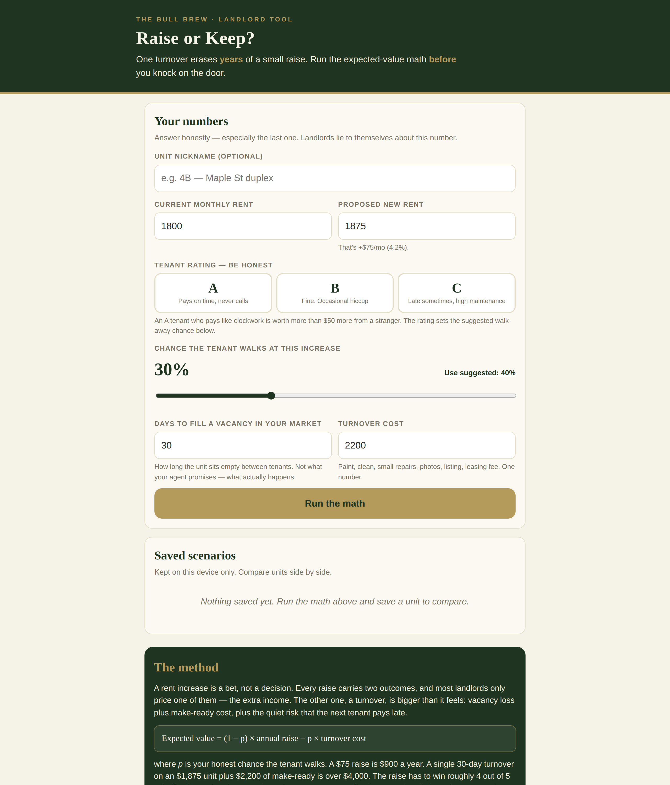

# Raise or Keep? — The Rent-Increase Math

**Live:** https://thebullbrew.github.io/rent-raise-ev/

A landlord tool that treats a rent increase like what it is: a bet. Enter the current rent, the proposed raise, your honest walk-away chance, days-to-fill, and turnover cost — it runs expected-value math and tells you whether the raise wins, breaks even, or bleeds you dry.

## What it does

- **Raise / Keep / Coin-flip verdict** with probability-weighted expected value over 12 months
- **Tenant rating (A/B/C)** that suggests a realistic walk-away chance based on the size of the increase
- **"Months of raise erased"** — how long it takes the raise to pay for the turnover it caused
- **Break-even line** — the maximum walk-away chance you can afford before the raise goes negative
- **Sensitivity table** — EV across walk-away chances from 0% to 75%, so you see exactly where the bet flips
- **Saveable scenarios** per unit, compared side by side (localStorage, on-device only)

## The method

A rent increase is a bet, not a decision. Most landlords price only the upside — the extra annual rent. The downside, a turnover, is bigger than it feels: vacancy loss plus make-ready cost.

`Expected value = (1 − p) × annual raise − p × turnover cost`

where *p* is your honest chance the tenant walks. A $75 raise is $900 a year. A single 30-day turnover on an $1,875 unit plus $2,200 of make-ready is over $4,000. Small gains, occasionally large losses — the asymmetry is the whole point. A known good tenant is an asset. Price the raise like you'd price losing one.

## How to run

No build step, no backend. Open `docs/index.html` directly in a browser, or serve the `docs/` folder with any static host. Works offline once installed (PWA manifest + service worker included).

Part of the [daily finance & real estate apps](https://github.com/thebullbrew?tab=repositories) series by [thebullbrew](https://github.com/thebullbrew).
